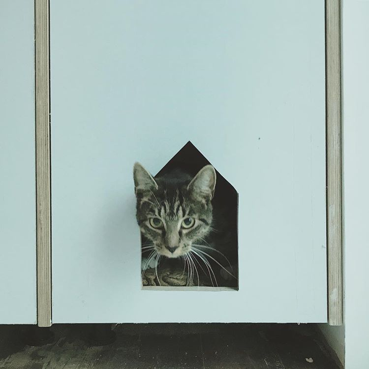

AppKit contains all the objects you need to implement the user interface for a macOS app—windows, panels, buttons, menus, scrollers, and text fields—and it handles all the details for you as it efficiently draws on the screen, communicates with hardware devices and screen buffers, clears areas of the screen before drawing, and clips views.

The framework also provides APIs you use to make your app accessible to users with disabilities (see Accessibility); to learn more about localizing your app for different languages, countries, or cultural regions, see Internationalization and Localization Guide.

# heading 1

## heading 2

### heading 3

#### heading 4

##### heading 5


##### 


- - -

- - -




- - -

1. First ordered list item
2. Another item
   ⋅⋅* Unordered sub-list. 
3. Actual numbers don't matter, just that it's a number
   ⋅⋅1. Ordered sub-list
4. And another item.

[I'm an inline-style link](https://www.google.com)

Inline `var code` has `back-ticks around` it.

```javascript
var s = "JavaScript syntax highlighting";
alert(s);
```

```python
s = "Python syntax highlighting"
print s
```

```
No language indicated, so no syntax highlighting. 
But let's throw in a <b>tag</b>.
```

| Tables        | Are           | Cool  |
| ------------- | ------------- | ----- |
| col 3 is      | right-aligned | $1600 |
| col 2 is      | centered      | $12   |
| zebra stripes | are neat      | $1    |

> Blockquotes are very handy in email to emulate reply text.
> This line is part of the same quote.
